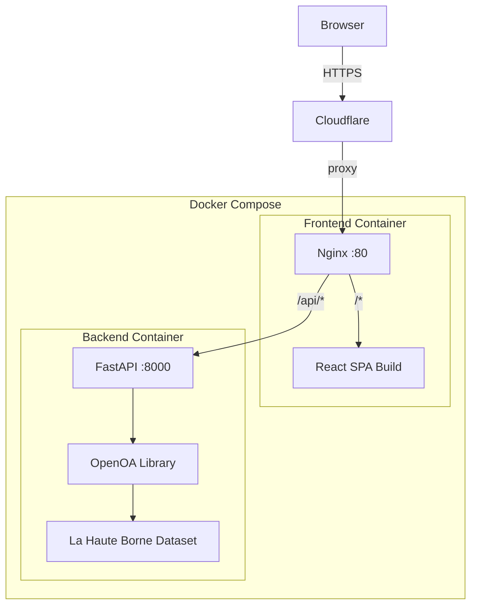

# OpenOA Web Application — Build and Deploy Plan

## Architecture Overview




Two Docker containers orchestrated via `docker-compose.yml`:

- **Backend**: FastAPI + OpenOA + pre-loaded example data
- **Frontend**: Nginx serving a React (Vite) production build, also reverse-proxying `/api` to the backend

## Project Structure

New files will be created inside the existing repo:

```
OpenOA/
├── backend/
│   ├── Dockerfile
│   ├── requirements.txt
│   ├── app/
│   │   ├── main.py                # FastAPI app, CORS, lifespan
│   │   ├── config.py              # Settings
│   │   ├── routers/
│   │   │   ├── plant.py           # Plant summary, turbine info
│   │   │   ├── analysis.py        # Analysis endpoints
│   │   │   └── data.py            # SCADA data, wind rose
│   │   ├── services/
│   │   │   ├── plant_loader.py    # Load La Haute Borne via project_ENGIE
│   │   │   └── analysis_runner.py # Run OpenOA analyses, cache results
│   │   └── schemas.py             # Pydantic response models
├── frontend/
│   ├── Dockerfile
│   ├── nginx.conf
│   ├── package.json
│   ├── vite.config.ts
│   ├── tsconfig.json
│   ├── index.html
│   ├── public/
│   ├── src/
│   │   ├── main.tsx
│   │   ├── App.tsx
│   │   ├── index.css              # Global styles, fonts, CSS variables
│   │   ├── api/
│   │   │   └── client.ts          # Axios/fetch wrapper for /api
│   │   ├── pages/
│   │   │   ├── Dashboard.tsx       # Overview + key metrics
│   │   │   ├── DataExplorer.tsx    # SCADA time series + wind rose
│   │   │   ├── PowerCurves.tsx     # Per-turbine power curves
│   │   │   ├── AEPAnalysis.tsx     # AEP estimation results
│   │   │   ├── LossesAnalysis.tsx  # Electrical + wake losses
│   │   │   └── YawAnalysis.tsx     # Static yaw misalignment
│   │   ├── components/
│   │   │   ├── Sidebar.tsx
│   │   │   ├── MetricCard.tsx
│   │   │   ├── ChartCard.tsx
│   │   │   ├── TurbineTable.tsx
│   │   │   ├── WindRose.tsx        # Custom D3/SVG wind rose
│   │   │   ├── LoadingSpinner.tsx
│   │   │   └── StatusBadge.tsx
│   │   └── hooks/
│   │       └── useApi.ts
├── docker-compose.yml
└── .env.example
```

---

## Phase 1: Backend (FastAPI + OpenOA)

### 1.1 Data Loading Strategy

Reuse the existing [examples/project_ENGIE.py](examples/project_ENGIE.py) `prepare()` function to load the La Haute Borne dataset. On app startup (FastAPI lifespan), extract the zip and build the `PlantData` object, storing it in memory as a singleton.

Key code in `backend/app/services/plant_loader.py`:

```python
from examples.project_ENGIE import prepare
plant_data = None  # module-level singleton

def load_plant():
    global plant_data
    plant_data = prepare(path="examples/data/la_haute_borne", return_value="plantdata")
```

### 1.2 API Endpoints

**Plant Info** (`/api/plant/...`):

- `GET /api/plant/summary` — returns plant name, capacity (8.2 MW), turbine count (4), date range, location (lat/lon)
- `GET /api/plant/turbines` — returns asset table (id, lat, lon, hub height, rotor diameter, rated power)

**Data** (`/api/data/...`):

- `GET /api/data/scada?turbine_id=...&start=...&end=...&resample=1h` — returns time series SCADA data (power, wind speed, direction, temperature) with optional resampling for chart performance
- `GET /api/data/wind-rose?turbine_id=...` — returns binned wind direction/speed frequency data for wind rose chart
- `GET /api/data/monthly-energy` — returns monthly energy production aggregated from SCADA

**Analysis** (`/api/analysis/...`):

Each analysis endpoint runs the corresponding OpenOA class and returns JSON results. Heavy analyses are cached after first run.

- `POST /api/analysis/power-curve` — body: `{ turbine_id, method: "IEC"|"logistic_5"|"gam" }`. Uses `openoa.utils.power_curve` functions. Returns arrays of wind_speed and power for the fitted curve plus scatter data. Fast (seconds).
- `POST /api/analysis/electrical-losses` — body: `{ uncertainty: bool }`. Runs `ElectricalLosses` analysis. Returns loss percentage, turbine energy, meter energy. Fast.
- `POST /api/analysis/wake-losses` — body: `{ wind_direction_data_type: "scada" }`. Runs `WakeLosses`. Returns plant-level and per-turbine wake loss percentages. Moderate speed.
- `POST /api/analysis/yaw-misalignment` — body: `{ turbine_ids, ws_bins }`. Runs `StaticYawMisalignment`. Returns per-turbine misalignment values. Moderate speed.
- `POST /api/analysis/aep` — body: `{ reanalysis_products, reg_model, time_resolution }`. Runs `MonteCarloAEP`. This is slow (~minutes). Return results from cache or run async with a polling pattern:
  - Returns `{ task_id, status: "running" }` immediately
  - `GET /api/analysis/aep/status/{task_id}` — poll for results
  - Results include AEP (GWh), availability, curtailment, long-term ratio, uncertainty bounds

**Health**:

- `GET /api/health` — returns `{ status: "ok", plant_loaded: true }`

### 1.3 Backend Dockerfile

```dockerfile
FROM python:3.10-slim
WORKDIR /app
COPY requirements.txt .
RUN pip install --no-cache-dir -r requirements.txt
COPY . /app/
# Copy OpenOA source and examples data into the container
COPY ../openoa /app/openoa
COPY ../examples /app/examples
COPY ../pyproject.toml /app/pyproject.toml
RUN pip install -e /app/  # Install OpenOA from source
EXPOSE 8000
CMD ["uvicorn", "app.main:app", "--host", "0.0.0.0", "--port", "8000"]
```

`requirements.txt` additions beyond OpenOA deps:

- `fastapi`
- `uvicorn[standard]`
- `pydantic>=2.0`

### 1.4 Caching and Performance

- Use a simple in-memory dict to cache analysis results keyed by parameters hash
- Heavy analyses (AEP, Wake Losses) run in `asyncio.to_thread()` to avoid blocking
- SCADA data endpoints support resampling (`resample` param) to reduce payload for charts
- Consider pre-computing common analyses on startup in a background task

---

## Phase 2: Frontend (React + Vite)

### 2.1 Tech Stack

- **React 18** + **TypeScript** + **Vite**
- **Recharts** for line charts, bar charts, scatter plots
- **Custom SVG** for wind rose component
- **React Router** for page navigation
- No Tailwind — use custom CSS with CSS variables per the frontend-design skill (avoids generic look)
- **Framer Motion** for page transitions and micro-interactions

### 2.2 Design Direction (Frontend-Design Skill)

**Aesthetic: "Nordic Observatory"** — inspired by Scandinavian industrial design meets modern data visualization. Clean, purposeful, with restrained luxury.

- **Color Palette**:
  - Background: deep charcoal `#0D1117` with subtle noise texture
  - Surface: `#161B22`
  - Primary accent: electric cyan `#00D4AA`
  - Secondary accent: warm amber `#F5A623`
  - Text: `#E6EDF3` (primary), `#7D8590` (secondary)
  - Chart colors: curated palette of 4-5 distinct colors for turbine data
- **Typography**:
  - Headings: **"Outfit"** (Google Fonts) — geometric, modern, distinctive
  - Body/Data: **"JetBrains Mono"** for numeric/data content
  - Navigation: **"Outfit"** at lighter weight
- **Layout**:
  - Fixed left sidebar (narrow, icon-based with labels on hover/expand)
  - Main content area with card-based panels
  - Generous spacing, 8px grid system
  - Cards have subtle border (`1px solid rgba(255,255,255,0.06)`) and backdrop blur
- **Motion**:
  - Staggered card entrance on page load (Framer Motion)
  - Smooth chart data transitions
  - Hover effects on interactive elements with subtle scale/glow
- **Distinctive Elements**:
  - Animated wind turbine icon in sidebar (CSS animation, rotates slowly)
  - Gradient mesh subtle background accent in header area
  - Data metric cards with bottom-border accent color matching data category

### 2.3 Pages

**1. Dashboard** (`/`)

- Top row: 4 metric cards (Plant Capacity, Turbine Count, Date Range, Avg Wind Speed)
- Middle: Monthly energy production bar chart (from `/api/data/monthly-energy`)
- Bottom left: Turbine asset table with key specs
- Bottom right: Mini wind rose preview

**2. Data Explorer** (`/data`)

- Time series chart: power output over time for selected turbine(s)
- Wind speed time series overlay
- Full interactive wind rose chart (select turbine, direction bins, speed bins)
- Controls: date range picker, turbine multi-select

**3. Power Curves** (`/power-curves`)

- Scatter plot of wind speed vs power for each turbine
- Overlay fitted curves (IEC, logistic, GAM — user selects method)
- Turbine selector dropdown
- Side panel showing curve fit statistics

**4. AEP Analysis** (`/aep`)

- Configuration form: reanalysis products (checkboxes), regression model (dropdown), time resolution
- "Run Analysis" button with loading state
- Results panel: AEP value with uncertainty range, availability %, curtailment %
- Bar chart of AEP results across Monte Carlo iterations (histogram)

**5. Losses Analysis** (`/losses`)

- Two sections: Electrical Losses and Wake Losses
- Electrical: percentage gauge/metric, total turbine vs meter energy comparison bar chart
- Wake: per-turbine wake loss bar chart, plant-level summary

**6. Yaw Misalignment** (`/yaw`)

- Per-turbine yaw misalignment bar chart
- Wind speed bin selector
- Confidence interval error bars on chart
- Summary table of values

### 2.4 Frontend Dockerfile

Multi-stage build:

```dockerfile
FROM node:20-alpine AS build
WORKDIR /app
COPY package*.json ./
RUN npm ci
COPY . .
RUN npm run build

FROM nginx:alpine
COPY --from=build /app/dist /usr/share/nginx/html
COPY nginx.conf /etc/nginx/conf.d/default.conf
EXPOSE 80
```

### 2.5 Nginx Config

```nginx
server {
    listen 80;
    root /usr/share/nginx/html;
    index index.html;

    location /api/ {
        proxy_pass http://backend:8000/api/;
        proxy_set_header Host $host;
        proxy_set_header X-Real-IP $remote_addr;
        proxy_read_timeout 300s;  # long timeout for AEP analysis
    }

    location / {
        try_files $uri $uri/ /index.html;  # SPA routing
    }
}
```

---

## Phase 3: Docker Compose

`docker-compose.yml`:

```yaml
services:
  backend:
    build:
      context: .
      dockerfile: backend/Dockerfile
    ports:
      - "8000:8000"
    environment:
      - PYTHONUNBUFFERED=1
    restart: unless-stopped

  frontend:
    build:
      context: ./frontend
      dockerfile: Dockerfile
    ports:
      - "80:80"
    depends_on:
      - backend
    restart: unless-stopped
```

The backend Dockerfile build context is the repo root (so it can access `openoa/`, `examples/`, and `pyproject.toml`), while the frontend context is `./frontend`.

---

## Phase 4: Deployment to DigitalOcean

1. SSH into the existing VPS
2. Clone the repo: `git clone https://github.com/NatLabRockies/OpenOA.git`
3. Build and start: `docker compose up -d --build`
4. Set up Cloudflare DNS (A record pointing subdomain to VPS IP)
5. Verify HTTPS works through Cloudflare proxy
6. Test all endpoints and pages

---

## Key Implementation Notes

- **Data Size**: The La Haute Borne zip is ~110MB uncompressed. SCADA CSV alone is 41MB. All data loading happens in-memory during container startup (expected 30-60s boot time). This is fine for a demo.
- **MonteCarloAEP is slow**: It uses Monte Carlo simulation and can take minutes. Implement as a background task with polling. Optionally pre-compute on startup and cache.
- **The backend needs OpenOA installed**: The Dockerfile installs OpenOA from the repo source via `pip install -e .`. The backend Python path must include the repo root so `examples/project_ENGIE.py` can be imported.
- **Chart data should be resampled**: Raw SCADA has ~210K rows per turbine at 10-min frequency. Always resample to hourly or daily for chart endpoints. Provide pagination for table views.
- **Frontend uses the skill**: Follow the [frontend-design skill](/Users/onepiece/.codex/skills/frontend-design/SKILL.md) principles — distinctive typography (Outfit + JetBrains Mono), dark theme with cyan/amber accents, motion via Framer Motion, no generic AI aesthetics.

